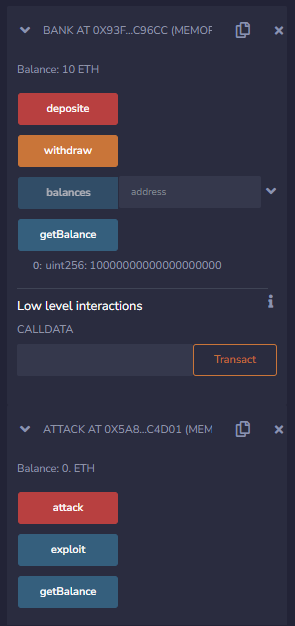
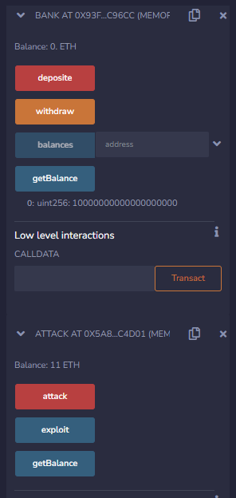
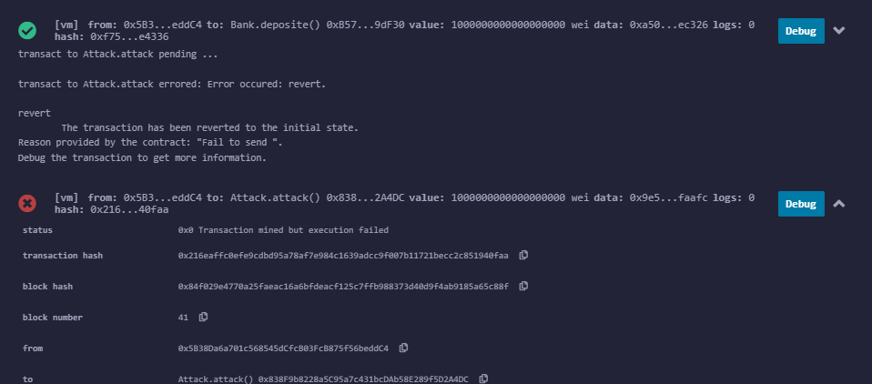

# Smart Contract Reentrancy Attack
- A smart contract reentrancy attack is a type of exploit that targets vulnerabilities in the design of blockchain-based smart contracts
- In a reentrancy attack, an attacker initiates a recursive call to the same or another external contract from within a vulnerable smart contract before the original call is completed. This can lead to unexpected and potentially malicious behavior, as the contract's state might be altered multiple times within a single transaction. The attacker can manipulate the contract's logic to gain unauthorized access, withdraw funds, or disrupt its intended functionality.

## How attack works
### Before

### After

- <a href="Contract.sol">Contract</a> somply use updating balance before transaction to prevent reentrancy attack

- <a href="GuardContract.sol">Guard Contract</a> use <a href="https://github.com/OpenZeppelin/openzeppelin-contracts/blob/master/contracts/utils/ReentrancyGuard.sol">ReentrancyGuard by Openzeppelin</a>

